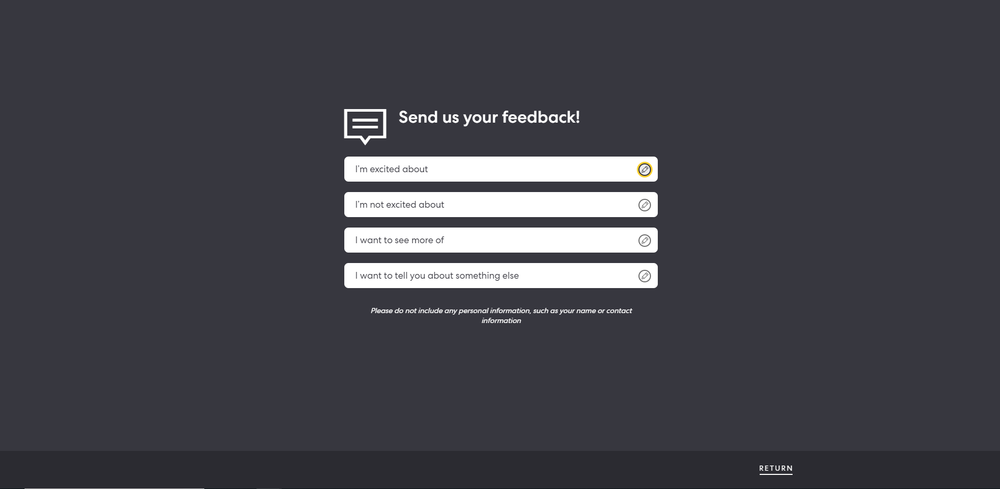

# Responsible Data Use Assessment for Collab

**Overview of the Prototype:**

We all want more say in our communities, but life and work can make it hard to participate in person. [Collab](https://collab.sidewalklabs.com) is a prototype built by Sidewalk Labs (SWL) and Digital Public Square (DPS) to help break through barriers to help people participate from anywhere, at anytime. Collab is a proposed digital tool that invites community members to influence the potential programming of public spaces, through exploring tradeoffs and sharing ideas and suggestions. SWL and DPS built Collab to learn about how to best support communities in their effort to increase participation and make more inclusive decisions.

Users select three program choices, or propose one of their own, see trade-offs, and see what other community members have proposed. Users can opt-in to sharing broad demographic information that enables a comparison of programming choices, for example of people with “x” demographic. The program choices are examples of the types of programs that people may want to see in their community. Collab asks users to imagine a public space in their neighbourhood, but does not depict a specific neighbourhood. 

With increased transparency into processes, decision points, trade-offs, and outcomes that allow everyone to see the results of their input, a larger number of community members have the potential to feel satisfied that their voice is heard, and their input considered. This ultimately has the potential to increase the durability of decisions being taken that have impacts on that community. There are also additional potential benefits including an increased feeling of pride, ownership, and belonging in the community.  

The data collected in the prototype version of Collab will be used to inform future versions of community engagement tools. It is not intended to influence the design and site plan for Quayside in the Master Innovation and Development Plan (MIDP). 

The welcome screen for Collab:

Users are invited to choose event programming for a neighbourhood for “summer Saturdays”:

Users select up to three events, or can create their own custom event:

Users select up to three events, or can create their own custom event:

Users then see their choices placed on the plaza: 

Users then review benefits and trade-offs based on their choices: 

**Privacy and Data Governance Considerations:**

Users can opt-in to sharing broad, range-level demographic data (age range, ethnicity, gender, living situation) as part of the prototype. Users are not required to share personal information to use the prototype. Sidewalk Labs ensures any data provided by users is not identifiable and that data is encrypted. Sidewalk Labs collects information about who uses the website and how the website is used. The website server scrubs the user’s IP address as soon as it receives a request to avoid identifying individual users. Google Analytics is used to log clicks and pathways and utilizes [IP address anonymization](https://support.google.com/analytics/answer/2763052?hl=en) to identify the user’s continent, country, region and city, but no further details. The use of the Collab prototype does not mean that a user’s exact location is known or tracked. This information is not used to serve users ads. 

The prototype involves programming choices in a fictitious place, therefore, the data collected from users will not be used to influence real community programs. Because of this there is limited potential for individuals, groups of people, and communities to be impacted in real ways. Learnings from the prototype are intended to inform the viability and relevance of a future version of Collab for implementation in a real community. In a future implementation of Collab, continued consideration will need to be given to ensure that data that is needed to evaluated inclusivity, such as demographic data, is not being used to favour or discriminate against particular groups in unfair or prejudicial ways. Other considerations will include ensuring that provided program choices which will serve as the “default” choices do not exclude groups of people from participation.

**Mitigation efforts:**

**No Collection of Personal Information**

Users are not required to share information that will personally identify them to use the prototype and are not prompted or invited to share such information. On each page with an option to share more about themselves the user has the option to choose “rather not say.” 

Users are provided with information on what data is collected and how that data is used:

Users can agree to share broad level demographic information about themselves. Users can find out why this information is being asked for and decline to submit this information:

Users can read more information under “WHY WE’RE ASKING”: “We believe Collab could help community organizations, like neighbourhood associations or parks and public space nonprofits, make more inclusive decisions while respecting individual privacy. In this prototype you can voluntarily provide general demographic information about yourself to be included with your choices and shared in aggregate with the online community trying Collab. You will not be personally identified through this information. Sidewalk Labs and Digital Public Square use this information to evaluate whether the prototype encourages more diverse and inclusive participation. You can explore what others have submitted on this page whether or not you choose to share more information about yourself.”

An example of the demographic screen users would see. For each option users have the opportunity to click “Rather Not Say” or can close out of the window completely by clicking the X in the upper righthand corner. 

**Stakeholder Concerns:**

**Sharing and Access to Data**

Sidewalk Labs (SWL) and Digital Public Square (DPS) will have access to all data, but DPS may not use the data except on behalf of SWL to assess the prototype, provide recommendations, and to develop the prototype and subsequent versions of Collab. Aggregate counts of program choice submissions are publicly shared in the platform prototype directly. Users are able to see program selections that others have created in aggregate by demographic. Such as “top 3 program choices by people who live with roommates.”

An example of what a user sees when they compare event selections with other users:

Sidewalk Labs will publish findings and lessons learned from the Collab prototype, including aggregate, non-personal program choice counts and demographic data and individual program choice submissions. User-generated feedback will be incorporated into the findings. 

**Data Storage**

Data from the Collab prototype is stored as part of the Google Cloud Platform Region in Montréal, Canada. 

**Minimum Technology Used and Data Collected to Meet the Objectives**

The purpose of this prototype is to create a tool that allows community members to participate in programming and design choices in their community. Collab was designed with this specific purpose in mind. There are numerous attempts at inclusive digital planning, but this is still a nascent field and ready for additional prototypes and products. Personal information is not required to meet the objectives of this planning tool, thus Sidewalk and Digital Public Square designed this tool to not require or request personal information.

At any point while using Collab, users are able to provide feedback. Once again, users are reminded to not submit personal information.

**Summary:**

The purpose of the Collab prototype is to validate a use case around increasing community participation in local programming decisions. Public consultation and feedback are part of Canadian democratic values. By having more inclusive tools that provide means for more community members to participate, Collab builds on these values and helps strengthen them in communities. This prototype has been approved because the benefits outweigh the potential risks of harms. The insights derived from the prototype will be used to assess the risks and benefits of a similar public engagement tool. If a similar public engagement tool is to be used in a real community with real world impacts on individuals and groups of people, a new RDUA will be required to ensure the breadth of benefits and risks are known. 
